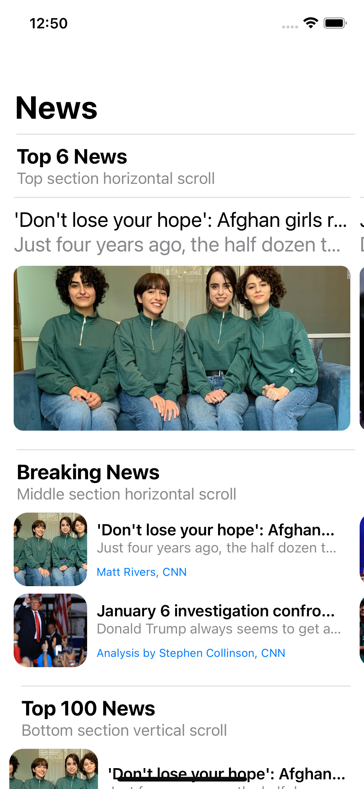
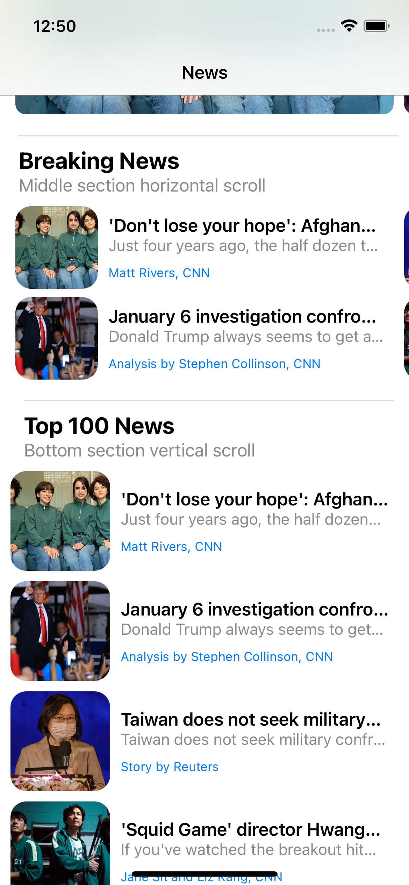
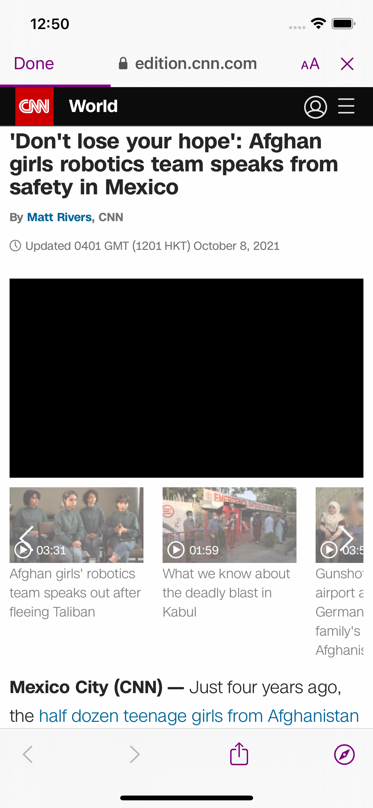

# Baraka iOS Test assignment
## News App

- Create an iOS App to display a news feed  using the news api.

### High-level requirements:
1. Use the data from the json file:
https://saurav.tech/NewsAPI/everything/cnn.json
2. Use UICollectionViewCompositionalLayout to present the
feed.
3. The top section of the feed should have horizontal scroll
direction. This component should show news with their titles
and images. (Latest 6 news from json file)
4. The bottom section of the feed should have vertical scroll
direction. This component should show all news with their
titles, dates, images and full descriptions.

## Installation
- Pod install.
- using SDWebImage framework for caching & displaying image in cells.
- open NewsAppBaraka.xcworkproj. 
- Select the iphone simulator of your choice & run it. 
- Tested on iOS 14.3, iOS 14.5 ( iphone SE, iphone 12 pro).

## Design Pattern: Model-View-ViewModel-Coordinator (MVVM)
is a structural design pattern that separates objects into three distinct groups:
- #### Models 
  - hold application data. They’re usually structs or simple classes.
- #### Views 
  - display visual elements and controls on the screen. They’re typically subclasses of UIView.
- #### View models
  - transform model information into values that can be displayed on a view. They’re usually classes, so they can be passed around as references.

## Requirements

- **1. Use the data from the json file:**
- https://saurav.tech/NewsAPI/everything/cnn.json. 
- NetworkManager contains basic network layer.

- **2. Use UICollectionViewCompositionalLayout to present the
feed.**
- used the collectionviewcompositionalLayout with three different layout top(single horizontal), middle( 2 cell horizontal) and bottom (vertical).
-  For UI part I've decided to mainly do the UI layout in code, I decided this as it's much easier to control and reuse the UI layout. 

3. The top section of the feed should have horizontal scroll
direction. This component should show news with their titles
and images. (Latest 6 news from json file)

4. The bottom section of the feed should have vertical scroll
direction. This component should show all news with their
titles, dates, images and full descriptions.

5. Implemented a simple generic alert for Network Reachability for no connectivity.

6. Implemented a SafariViewController for detail view.

- **2. Limitation**

- Code not fully tested. I tried adding some unit test for getNews API and some UI tests, but didn't have time  complete  all the tests.

- UI Design could be improved. I didn't want to spend too much time coming up with the UI so I decided to go with a very basic UI.

- **3. Known Issues**

- Navigation bar is little buggy.

    
  ## Improvements / Need to be done
- Due to limited time constraints, wrote only few unit Tests and UI tests by using XCTest. Need to cover all unit test.
- Generic networking layer for all apis.
- Navigation bar improvement
- Infinite scroll on bottomview for better experience.

## Technology/Tools

- iOS 13
- Xcode 12
- Swift 5
- UIKit
- Combine
- Codable, Decodable
- [SDWebImage](https://github.com/SDWebImage/SDWebImage)
- Programmatically written UI
- AutoLayout
- MVVM
- Nightmode
- XCTestCase for unit tests and UI Tests.
- Xcode Instruments for memory leaks and allocations.

## Demo

